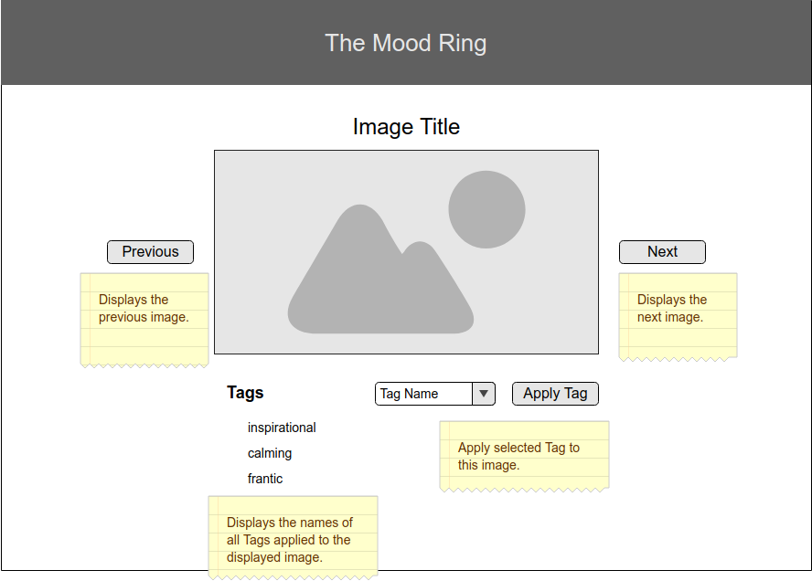

# React-Redux with Sagas

> **PLEASE COMMENT YOUR CODE.** Do not clone this repository. Instead, download the zip, extract the contents, `git init`, `git add .`, `git commit -m "initial commit - base project"` and add your remote. Please do this before you leave for the day.

For this weekend challenge you'll be building a mindfulness application: an image carousel tagging app!  

## Database Setup

1. Create a database named `saga_weekend`
2. Run the queries from `database.sql` on the `saga_weekend` database.
3. You will need to create the junction table between the `images` and `tags` tables! Your app will be populating this new table.

## Install Dependencies

1. `npm install`
2. `npm run server`
3. `npm run client`

## Notes

### Tags

We've given you some starter tags in the database. Feel free to change or add some with Postico.
 
 ### Images
 We've added some abstract images in the `public/images` folder, and the database is set up to use them.

 ### Relationships
 Tags can be applied to many different images. Images can have multiple tags. This is Many-to-Many! Junction Table time!
 

**Do not implement image upload for base mode.**

## Feature List

> NOTE: Start by taking inventory of the existing code. Part of the work for setting up sagas has been done for you.

## Back-End

### Database
- [x] Create Tag, Image tables 
- [ ] Create a Junction Table for storing the tags associated with the images

### Routes
Feel free to make up your own. You may need others beyond these:

- [ ] GET `/api/tags` -- Should return all tags
- [ ] GET `/api/images` -- Should return all images and the tags associated with each image (JOIN!)
- [ ] POST `/api/images/addtag` -- Should add a tag associated with an image to your junction table.

## Front-End

### Carousel 

** DO NOT USE ANY PREBUILT CAROUSEL NOR CAROUSEL-ISH (MUI STEPPER) THING **

You can build this! Other components from Material-UI are fine.

- [ ] Client-side view that displays a single image at a time, using data from database.
- [ ] Each image should have an ability to cycle through to the next/previous image. These should always work -- if you hit next on the last picture, it should go to the first image.
- [ ] With each image, users should be able to assign tags to the current image and save in the database. For base mode, duplicate tags are fine.
- [ ] Use Sagas for API requests to your server

### General Tasks

- [ ] Commit your code frequently! You should have at 15+ commits on a project of this size. Use branches to help break down your features.
- [ ] Comment your code.
- [ ] Update this README to include a description of the project in your own words.

## Wireframes

> NOTE: Feel free to modify the styling and layout of content on the page. 

### Main View

## Stretch Goals

- [ ] Animate it -- Look into transitions -- give us a nice fade in/out, or slide in, or something aesthetically pleasing
- [ ] Allow users to delete tags from an image.
- [ ] Give each tag associated to an image a different color
- [ ] Improve styling on the page using Material UI
  - [ ] Make it Responsive (Research Grid)
  - [ ] Give it a theme
- [ ] Create a view that can pull statistics -- How many images have X tag, for example. Think about the data you can access!
- [ ] Implement a form to add new tags and/or images

